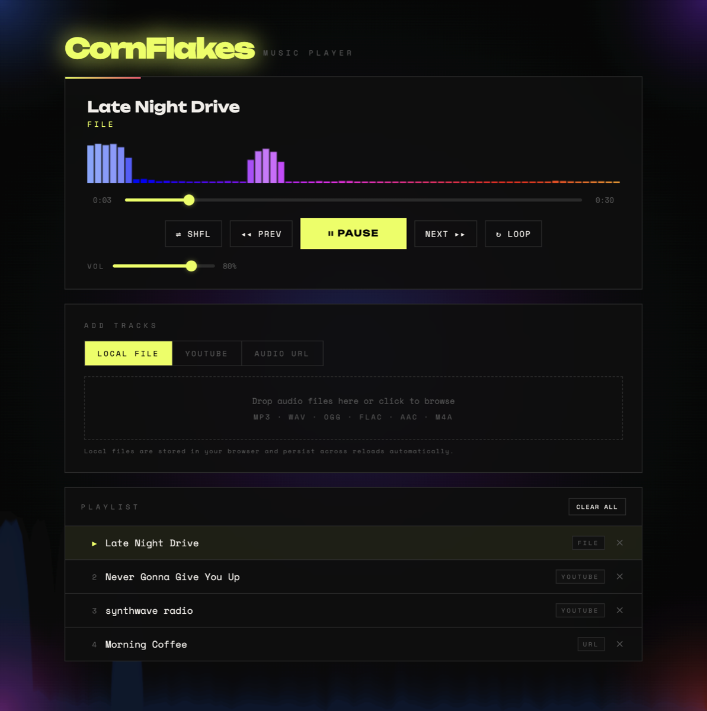
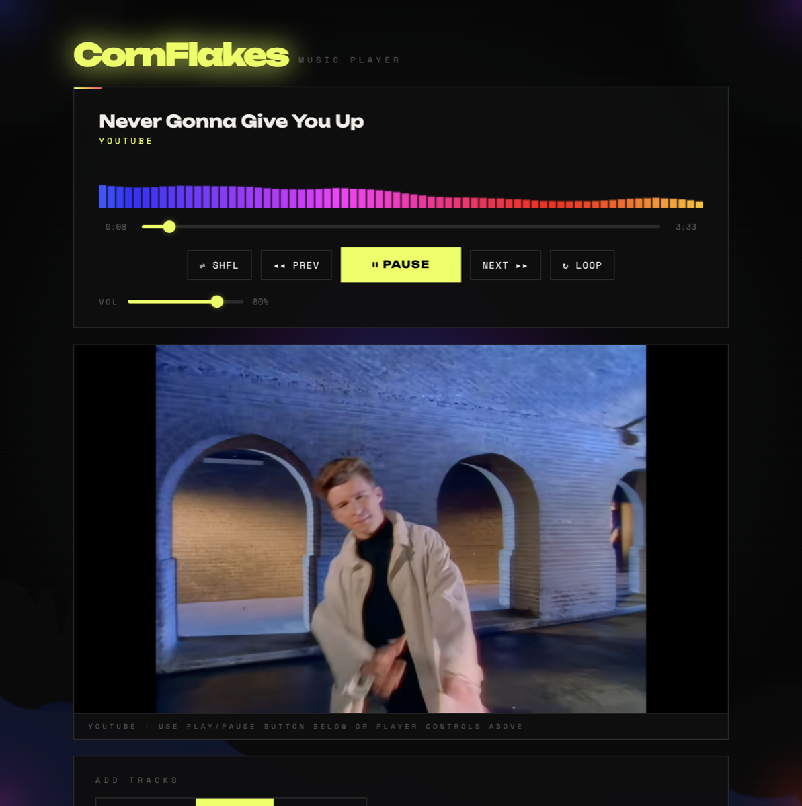

# CornFlakes Music Player

A small music player with a loud visualiser. Drop in your own audio files, paste a YouTube link, or point it at an audio URL, and it'll remember your playlist next time you visit.

**Try it: [cardboardflakes.github.io/Music](https://cardboardflakes.github.io/Music/)**



## What it does

- **Local files.** Drag and drop MP3, WAV, OGG, FLAC, AAC or M4A, or click to browse.
- **YouTube.** Paste a video link and it plays in a panel below the controls, with the same play, pause, seek, next and volume controls as everything else.
- **Audio URLs.** Any direct link to an audio file.
- Shuffle, loop, a seek bar and volume.
- A visualiser that reacts to whatever's playing.



A heads-up on the visualiser: for local files it's drawing the real audio. YouTube and remote URLs don't let the page read their audio, so for those it shows a convincing fake that keeps to a beat.

YouTube videos whose owners have turned off embedding won't play. When that happens the player says so and skips to the next track.

## Where your playlist lives

Everything stays in your browser. The playlist is kept in `localStorage`, and any files you add are stored in IndexedDB. Nothing gets uploaded anywhere.

That also means your playlist doesn't follow you around. Each browser on each device has its own, and clearing your site data wipes it.

## Running it yourself

It's one file. Open `index.html` in a browser, or serve the folder with any static server:

```bash
python3 -m http.server 8000
```

Then go to http://localhost:8000. YouTube embeds need the page served over http(s), so they won't work if you open the file directly from disk.
